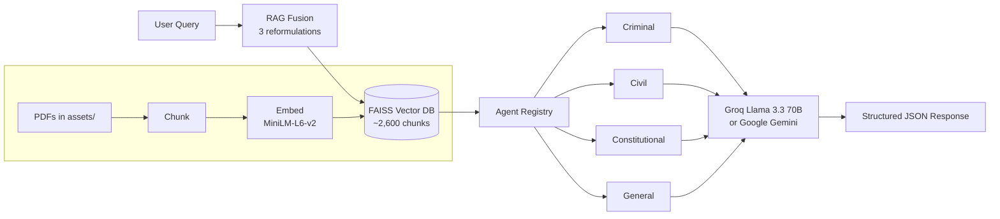

# Indian Law AI Portal

An **AI-powered legal query assistant** for Indian laws using **RAG (Retrieval-Augmented Generation)** and specialized **agentic AI**. It answers questions about Indian legal matters by retrieving from official government law books (Constitution, BNS, BNSS, IPC, CrPC, CPC) and routing the query to a domain-expert agent.


---

## Features

- **4 specialized legal agents** — Criminal, Civil, Constitutional, General — each with tailored prompts and keyword routing
- **RAG Fusion (n=3)** query reformulations for better recall, with reciprocal-rank fusion across variants
- **FAISS vector search** over chunked official PDFs (~2,600 chunks across 6 documents)
- **Two LLM providers** — Groq (Llama 3.3 70B, recommended) or Google Gemini, switchable via `LLM_PROVIDER`
- **Local embeddings by default** (`all-MiniLM-L6-v2`) — no API quota for ingestion
- **FastAPI** backend with auto-generated docs at `/docs`, **React 18** frontend

---

## Architecture



---

## Quick Start

### Prerequisites

- Python 3.11 (recommended for ML wheels — works on 3.10–3.13; avoid 3.14 for now)
- Node.js 16+
- A **Groq API key** (free, generous limits — [console.groq.com/keys](https://console.groq.com/keys)) **or** a **Google AI key** ([Gemini](https://makersuite.google.com/app/apikey); free tier is rate-limited hard)
- Conda (recommended for the Python env)

### 1. Configure environment

```bash
cp .env.example .env
```

Edit `.env`:

```env
LLM_PROVIDER=groq                      # "groq" or "gemini"
GROQ_API_KEY=your_groq_api_key_here
GROQ_MODEL=llama-3.3-70b-versatile

# (only needed if LLM_PROVIDER=gemini)
GOOGLE_API_KEY=your_google_api_key_here
LLM_MODEL=gemini-2.5-flash

EMBEDDING_MODEL=all-MiniLM-L6-v2       # local; switch to gemini-embedding-001 only on a paid Google tier
API_PORT=8000
```

### 2. Create the conda env (one time)

```bash
conda create -n my_env -c conda-forge python=3.11 -y
conda activate my_env
pip install -r requirements.txt groq
```

### 3. Run

```bash
# Option A — both backend + frontend
./start_dev.sh

# Option B — manual
conda activate my_env
python backend/main.py        # IMPORTANT: from project root, not from inside backend/

cd frontend && npm install && npm start    # in another terminal
```

| Service | URL |
|---|---|
| Frontend | http://localhost:3000 |
| Backend API | http://localhost:8000 |
| API docs (Swagger) | http://localhost:8000/docs |

> The backend resolves `assets/` and `vector_db/` against the project root, so always launch from the project root. On first start it auto-ingests every PDF in `assets/` (~30 seconds with local embeddings).

---

## Adding documents

Drop PDFs into `assets/`. They get auto-ingested on next backend start. To trigger a manual reprocess:

```bash
curl -X POST http://localhost:8000/api/v1/admin/documents/process \
     -H 'Content-Type: application/json' \
     -d '{"file_paths": ["IPC.pdf", "CrPC.pdf"]}'
```

---

## API endpoints

| Method | Endpoint | Description |
|---|---|---|
| `POST` | `/api/v1/query` | Process a legal query |
| `POST` | `/api/v1/query/advanced` | Query with filters, custom fusion count, reasoning trace |
| `GET` | `/api/v1/agents` | List available agents |
| `POST` | `/api/v1/validate` | Validate a query without processing it |
| `POST` | `/api/v1/admin/documents/process` | Reprocess specific PDFs |
| `GET` | `/api/v1/admin/documents/list` | List PDFs in `assets/` |
| `GET` | `/api/v1/admin/statistics` | Vector DB stats, model info, configuration |
| `GET` | `/health/` | System health |
| `GET` | `/health/ready` | Readiness probe |

---

## Sample queries

| Domain | Query | Routes to |
|---|---|---|
| Criminal | `What is the punishment for theft under IPC?` | Criminal Law Agent |
| Criminal (BNS) | `What does the Bharatiya Nyaya Sanhita say about murder?` | Criminal Law Agent |
| Civil | `What is the limitation period for filing a civil suit?` | Civil Law Agent |
| Constitutional | `Explain the right to life under Article 21 of the Indian Constitution` | Constitutional Law Agent |
| Procedural | `What does the law say about plea bargaining?` | Criminal Law Agent (CrPC) |

```bash
curl -s http://localhost:8000/api/v1/query \
     -H 'Content-Type: application/json' \
     -d '{"query":"What is the punishment for theft under IPC?"}' | jq
```

Real response (Groq Llama 3.3 70B, retrieved from the actual ingested PDFs):

```json
{
  "agent_type": "Criminal Law",
  "confidence_score": 1.0,
  "retrieved_documents": 10,
  "answer": "**Direct Answer:** The punishment for theft under the Indian Penal Code (IPC) and its corresponding provisions in the Bharatiya Nyaya Sanhita (BNS) can vary depending on the circumstances of the case. Under the IPC, Section 380 specifically deals with 'Theft in dwelling house, etc.' and prescribes a punishment of imprisonment for a term which may extend to seven years, and also liable to fine. Section 381 of the IPC pertains to 'Theft by clerk or servant of property in possession of master' with a similar punishment...",
  "retrieval_sources": [
    {"document": "Indian_Penal_Code_1860",         "section": "Section-88",  "similarity_score": 0.539},
    {"document": "Code_of_Criminal_Procedure_1973", "section": "Section-624", "similarity_score": 0.518},
    {"document": "Code_of_Criminal_Procedure_1973", "section": "Section-626", "similarity_score": 0.530}
  ]
}
```

A bash regression script that exercises every endpoint (health, stats, validate, query, advanced query, edge cases — 17 cases) ships with the repo:

```bash
./test_runner.sh
```

---

## Configuration

| Variable | Default | Description |
|---|---|---|
| `LLM_PROVIDER` | `gemini` | `groq` or `gemini` |
| `GROQ_API_KEY` | – | Required when `LLM_PROVIDER=groq` |
| `GROQ_MODEL` | `llama-3.3-70b-versatile` | Groq model ID |
| `GOOGLE_API_KEY` | – | Required when `LLM_PROVIDER=gemini` |
| `LLM_MODEL` | `gemini-2.0-flash` | Gemini model |
| `EMBEDDING_MODEL` | `all-MiniLM-L6-v2` | Local; or `gemini-embedding-001` on a paid Google tier |
| `RAG_FUSION_QUERIES` | `3` | Query reformulation count |
| `TOP_K_RETRIEVAL` | `10` | Top-K vector results |
| `CHUNK_SIZE` | `500` | Words per chunk |
| `CHUNK_OVERLAP` | `50` | Word overlap between chunks |
| `API_PORT` | `8000` | Backend port |
| `DEBUG_MODE` | `true` | Uvicorn hot reload |

---

## Tech stack

FastAPI · React 18 · FAISS · Sentence Transformers (local embeddings) · Groq Llama 3.3 70B / Google Gemini · RAG Fusion · PyPDF2

---

> **Disclaimer.** Educational/research tool. Always consult a qualified legal professional for official advice. Keep your API keys out of version control.

MIT License.
