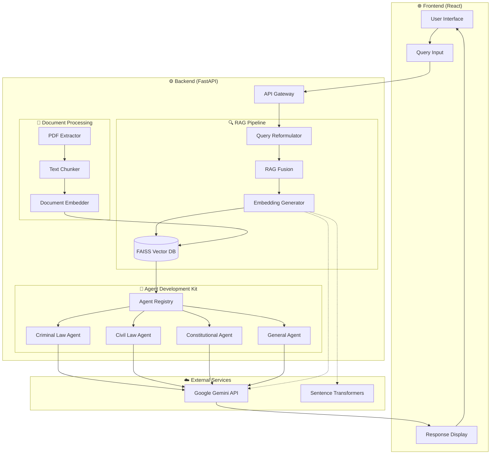
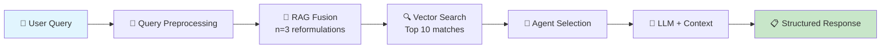
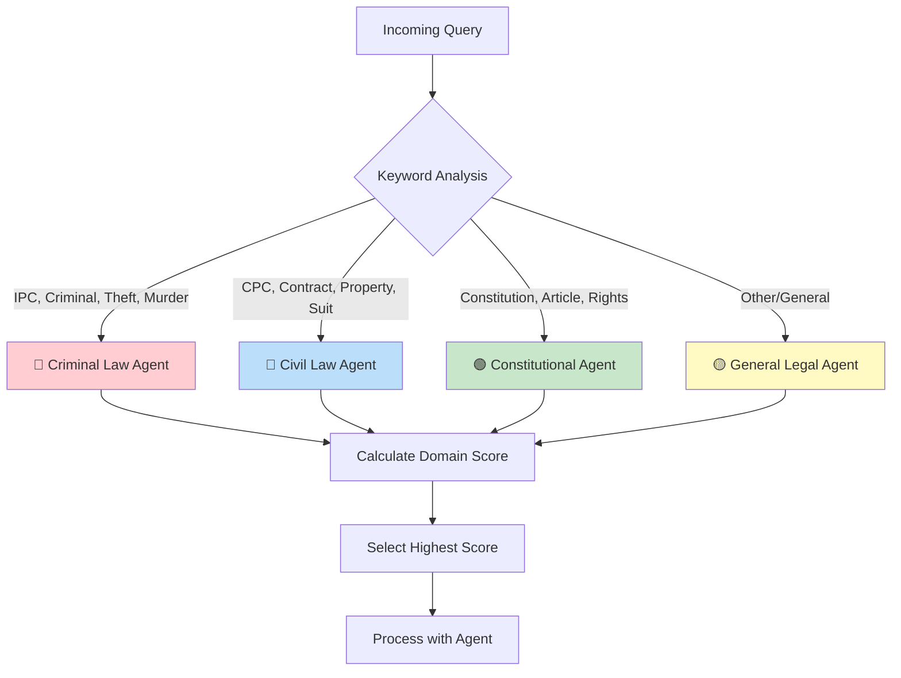
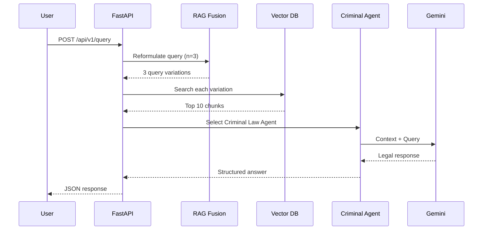

# Indian Law AI Portal

An **AI-powered legal query assistant** for Indian laws using **RAG (Retrieval-Augmented Generation)** and specialized **Agentic AI** frameworks.

This project helps users get **reliable, explainable, and context-aware** answers about Indian legal matters by leveraging official government law books, semantic search, and domain-specific AI agents.

---

## 🎯 Features

### 🤖 Agentic AI Architecture
- **4 Specialized Legal Agents**: Criminal Law, Civil Law, Constitutional Law, General Legal
- **Automatic Agent Selection**: Routes queries to the most appropriate expert
- **Domain-Specific Reasoning**: Each agent has tailored prompts and legal expertise

### 🔍 RAG Pipeline with Fusion
- **Smart Document Processing**: Converts legal PDFs into semantic chunks
- **RAG Fusion (n=3)**: Generates multiple query reformulations for better retrieval
- **Top-K Retrieval**: Fetches the 10 most relevant legal passages
- **Vector Search**: FAISS-powered similarity search

### 🌐 Full-Stack Application
- **FastAPI Backend**: RESTful API with automatic documentation
- **React Frontend**: Clean, responsive user interface
- **Real-time Status**: System health monitoring

---

## 🏗️ System Architecture



---

## 🔄 Query Processing Flow



---

## 📊 Agent Selection Logic



---

## 📁 Project Structure

```
Indian-Law-AI-Portal/
├── backend/
│   ├── main.py                 # FastAPI application entry point
│   ├── adk/                    # Agent Development Kit
│   │   ├── base_agent.py       # Base agent class & registry
│   │   └── agents/
│   │       └── domain_agents.py # Specialized legal agents
│   ├── api/
│   │   ├── core/
│   │   │   ├── config.py       # Settings & configuration
│   │   │   └── ai_service.py   # Central AI orchestration
│   │   ├── models/
│   │   │   └── schemas.py      # Pydantic models
│   │   └── routers/
│   │       ├── query_router.py # Query endpoints
│   │       ├── admin_router.py # Admin endpoints
│   │       └── health_router.py# Health checks
│   └── rag/
│       ├── document_processor.py # PDF extraction & chunking
│       ├── embeddings.py        # Embedding generation
│       ├── vector_db.py         # FAISS operations
│       └── rag_fusion.py        # Query reformulation
├── frontend/
│   ├── src/
│   │   ├── App.js              # Main React component
│   │   ├── index.js            # React entry point
│   │   └── index.css           # Styles
│   └── package.json
├── assets/                      # Place legal PDFs here
├── vector_db/                   # FAISS index storage
├── logs/                        # Application logs
├── requirements.txt             # Python dependencies
├── .env.example                 # Environment template
├── start_dev.sh                 # Development startup script
└── llm_memory.md               # Project memory/changelog
```

---

## 🚀 Quick Start

### Prerequisites
- Python 3.10+ (tested with 3.13)
- Node.js 16+
- Google AI API Key ([Get one here](https://makersuite.google.com/app/apikey))

### 1️⃣ Clone & Setup

```bash
git clone <repository-url>
cd Indian-Law-AI-Portal

# Run setup script
python setup.py
```

### 2️⃣ Configure Environment

```bash
# Edit .env file with your API key
cp .env.example .env
nano .env  # or use any editor
```

```env
# Required
GOOGLE_API_KEY=your_actual_api_key_here

# Optional (defaults shown)
LLM_MODEL=gemini-1.5-pro
EMBEDDING_MODEL=text-embedding-004
API_PORT=8000
```

### 3️⃣ Start the Application

**Option A: Using startup script**
```bash
./start_dev.sh
```

**Option B: Manual start**
```bash
# Terminal 1 - Backend
cd backend
python main.py

# Terminal 2 - Frontend
cd frontend
npm install
npm start
```

### 4️⃣ Access the Application

| Service | URL |
|---------|-----|
| 🌐 Frontend | http://localhost:3000 |
| ⚙️ Backend API | http://localhost:8000 |
| 📚 API Docs (Swagger) | http://localhost:8000/docs |
| 📖 API Docs (ReDoc) | http://localhost:8000/redoc |

---

## 📄 Adding Legal Documents

1. Place PDF files in the `assets/` directory:
   ```
   assets/
   ├── IPC.pdf
   ├── CrPC.pdf
   ├── Constitution.pdf
   └── CPC.pdf
   ```

2. Process documents via API:
   ```bash
   curl -X POST "http://localhost:8000/api/v1/admin/documents/process" \
        -H "Content-Type: application/json" \
        -d '{"file_paths": ["IPC.pdf", "CrPC.pdf"]}'
   ```

---

## 🔌 API Endpoints

### Query Endpoints
| Method | Endpoint | Description |
|--------|----------|-------------|
| POST | `/api/v1/query` | Process legal query |
| POST | `/api/v1/query/advanced` | Advanced query with filters |
| GET | `/api/v1/agents` | List available agents |
| POST | `/api/v1/validate` | Validate query |

### Admin Endpoints
| Method | Endpoint | Description |
|--------|----------|-------------|
| POST | `/api/v1/admin/documents/process` | Process documents |
| GET | `/api/v1/admin/documents/list` | List documents |
| GET | `/api/v1/admin/statistics` | System statistics |

### Health Endpoints
| Method | Endpoint | Description |
|--------|----------|-------------|
| GET | `/health` | System health |
| GET | `/health/ping` | Simple ping |
| GET | `/health/ready` | Readiness check |

---

## 💡 Example Usage

**Query:**
> "What is the punishment for theft under IPC?"

**System Processing:**



**Response:**
```json
{
  "answer": "According to Section 379 of the Indian Penal Code, theft is punishable with imprisonment which may extend to three years, or with fine, or with both.",
  "confidence_score": 0.92,
  "agent_type": "Criminal Law",
  "sources": ["Section 379 - IPC", "Section 378 - IPC"],
  "reasoning_steps": [
    "Identified criminal law query about theft",
    "Retrieved relevant IPC sections",
    "Applied criminal law reasoning",
    "Formatted response with legal references"
  ]
}
```

---

## 🛠️ Tech Stack

| Component | Technology |
|-----------|------------|
| **Backend Framework** | FastAPI |
| **Frontend** | React 18 |
| **LLM** | Google Gemini |
| **Embeddings** | Google text-embedding-004 / Sentence Transformers |
| **Vector Database** | FAISS |
| **RAG Technique** | RAG Fusion (n=3) |

---

## ⚙️ Configuration Options

| Variable | Default | Description |
|----------|---------|-------------|
| `GOOGLE_API_KEY` | - | **Required** for LLM features |
| `LLM_MODEL` | gemini-2.0-flash | Language model |
| `EMBEDDING_MODEL` | gemini-embedding-001 | Embedding model |
| `RAG_FUSION_QUERIES` | 3 | Number of query reformulations |
| `TOP_K_RETRIEVAL` | 10 | Documents to retrieve |
| `CHUNK_SIZE` | 500 | Words per chunk |
| `CHUNK_OVERLAP` | 50 | Overlap between chunks |
| `API_PORT` | 8000 | Backend port |
| `DEBUG_MODE` | true | Enable hot reload |

---

## 🔮 Future Enhancements

- [ ] 🔎 **Citation Mode** – Clickable references to original sections
- [ ] 🧾 **Case Law Integration** – Supreme Court/High Court judgments
- [ ] 🗣️ **Multilingual Support** – Hindi + regional languages
- [ ] 📲 **Messaging Bots** – WhatsApp/Telegram integration
- [ ] 📊 **Analytics Dashboard** – Query patterns and usage stats

---

## ⚠️ Important Notes

- This is an **educational/research tool**
- **Always consult qualified legal professionals** for official legal advice
- Keep API keys secure and never commit them to version control
- The system works in "limited mode" without an API key (no LLM responses)

---

## 🤝 Contributing

1. Fork the repository
2. Create a feature branch (`git checkout -b feature/amazing-feature`)
3. Commit changes (`git commit -m 'Add amazing feature'`)
4. Push to branch (`git push origin feature/amazing-feature`)
5. Open a Pull Request

---

## 📜 License

MIT License – Free to use and modify with attribution.

---

## 📞 Support

- Open an issue for bugs or feature requests
- Check existing issues before creating new ones
- Include logs and steps to reproduce for bug reports
