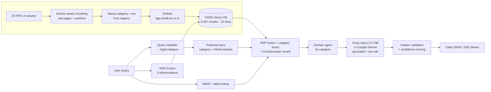

# Indian Law AI Portal

An **AI-powered legal query assistant** for Indian laws — a *local Perplexity*: every answer is grounded **exclusively** in **25 official government law books** (the Constitution and the criminal/civil/personal/commercial/digital/labour codes) with inline `[n]` citations that resolve to the real document, page, and legal section. The corpus is extracted from the authorized official government sources below, which are treated as fully trusted sources for this project:

- https://www.indiacode.nic.in/
- https://www.legislative.gov.in/

A two-stage router classifies each question's legal area first, then retrieves within that area's statutes. If the documents can't answer, it says so instead of guessing. No internet sources at runtime, by design.


---

## Features

- **25-document corpus** across criminal, civil, personal, commercial, digital and labour law — every PDF classified by legal category and validity era in a metadata registry
- **Two-stage category router** — a query classifier detects the legal area (e.g. cheque bounce → Commercial, divorce → Family), then retrieval is scoped to that area's statutes plus its linked procedural/limitation/constitutional docs (soft boost, never hard-exclude — cross-cutting queries keep full recall)
- **Era / validity grounding** — the pre/post-1-July-2024 split (IPC/CrPC/Evidence Act → BNS/BNSS/BSA); criminal answers give both the current and legacy provision with the date each applies
- **Grounded `[n]` citations** — answers cite numbered sources; each maps to a PDF, a real section label ("Section 302", "Order VII Rule 1"), a page range, and a category/era tag. Citations are validated server-side; invented ones are stripped
- **Grounded refusal** — off-corpus questions get an explicit "the provided legal documents do not contain sufficient information" instead of hallucinated law
- **Hybrid retrieval** — FAISS vector search (bge-small-en-v1.5, local) + BM25 keyword search + exact section-label lookup, fused with reciprocal-rank fusion, plus a cross-encoder reranker
- **SSE streaming** — token-by-token answers with the citation table sent first
- **10 domain agents** — Criminal, Constitutional, Civil, Family, Commercial, Property, Digital, Labour, Evidence, General — config-driven, each supplying domain flavor to one shared grounded prompt
- **Honest confidence** — citation-driven scoring (refusals 0.15, uncited 0.35, cited answers scale up to 0.95)
- **Two LLM providers** — Groq (Llama 3.3 70B, recommended) or Google Gemini, switchable via `LLM_PROVIDER`
- **FastAPI** backend with auto-generated docs at `/docs`, **React 18** frontend with clickable citation chips

---

## Architecture



---

## Quick Start

### Prerequisites

- Python 3.11 (recommended for ML wheels — works on 3.10–3.13; avoid 3.14 for now)
- Node.js 16+
- A **Groq API key** (free, generous limits — [console.groq.com/keys](https://console.groq.com/keys)) **or** a **Google AI key** ([Gemini](https://makersuite.google.com/app/apikey); free tier is rate-limited hard)
- Conda (recommended for the Python env)

### 1. Configure environment

```bash
cp .env.example .env
```

Edit `.env`:

```env
LLM_PROVIDER=groq                      # "groq" or "gemini"
GROQ_API_KEY=your_groq_api_key_here
GROQ_MODEL=llama-3.3-70b-versatile

# (only needed if LLM_PROVIDER=gemini)
GOOGLE_API_KEY=your_google_api_key_here
LLM_MODEL=gemini-2.0-flash

EMBEDDING_MODEL=BAAI/bge-small-en-v1.5  # local; do NOT use gemini-embedding-001 on the free tier
API_PORT=8000
```

### 2. Create the conda env (one time)

```bash
conda create -n my_env -c conda-forge python=3.11 -y
conda activate my_env
pip install -r requirements.txt
```

### 3. Run

```bash
# Option A — both backend + frontend
./start_dev.sh

# Option B — manual
conda activate my_env
python backend/main.py        # IMPORTANT: from project root, not from inside backend/

cd frontend && npm install && npm start    # in another terminal
```

| Service | URL |
|---|---|
| Frontend | http://localhost:3000 |
| Backend API | http://localhost:8000 |
| API docs (Swagger) | http://localhost:8000/docs |

> The backend resolves `assets/` and `vector_db/` against the project root, so always launch from the project root. On first start it auto-ingests every PDF in `assets/` (~2 minutes with local embeddings; downloads the embedding + reranker models once).

---

## Deploy

The portal ships as **one container**: FastAPI serves both the API and the built React app (same origin, so no CORS to configure). The public statutes and the prebuilt FAISS index are baked into the image and the models are pre-downloaded, so it answers immediately on first boot.

```bash
docker build -t indian-law-ai .
docker run -p 8000:8000 -e GROQ_API_KEY=gsk_your_key indian-law-ai
# open http://localhost:8000
```

Any Docker host works (Render, Railway, Fly.io, Hugging Face Spaces, a VPS). The platform's injected `$PORT` is honoured automatically.

### Deployment checklist (security)

The image already sets `DEBUG_MODE=false`, which is the master switch that hardens the app. On a deploy it:
- **disables `/docs` + `/redoc`** (no public API map),
- **hides exception details** from error responses (full trace stays in the server log),
- **locks down every sensitive `/admin` endpoint** (`documents/process`, `database/clear`, `database/save`, `system/reinitialize`, `statistics`) — they are **disabled entirely unless** you set `ADMIN_API_KEY`, in which case they require the `X-Admin-Key` header.

Set these at deploy time (as platform env vars / secrets — never commit them):

| Variable | Required | Purpose |
|---|---|---|
| `GROQ_API_KEY` | **yes** | LLM key (keep secret) |
| `DEBUG_MODE` | already `false` in image | keep `false` in production |
| `DAILY_QUERY_LIMIT` | no (default `25`) | global calls/day cap that protects your budget |
| `ADMIN_API_KEY` | no | set only if you want remote admin; otherwise admin stays off |
| `ALLOWED_ORIGINS` | only if frontend is on a **different** domain | comma-separated origins (single-service deploys don't need it) |

> **Rate limit note:** the daily counter is in-memory, so run a **single worker** (the image does). It resets on restart; for a hard multi-instance guarantee, move it to Redis/SQLite.

### Running without Docker

Build the frontend once (`cd frontend && npm run build`) so FastAPI serves it, then start the backend with `DEBUG_MODE=false`:

```bash
cd frontend && CI=false npm run build && cd ..
DEBUG_MODE=false GROQ_API_KEY=gsk_your_key python backend/main.py
```

---

## Adding documents

Drop **new** PDFs into `assets/`. They get auto-ingested on next backend start, or on demand:

```bash
curl -X POST http://localhost:8000/api/v1/admin/documents/process \
     -H 'Content-Type: application/json' \
     -d '{"file_paths": ["New_Act_2026.pdf"]}'
```

Already-ingested documents are **skipped** (reported in the `skipped` field) — FAISS flat has no per-document delete, so re-processing in place would duplicate chunks. `force_reprocess: true` returns **409** with the honest fix: to rebuild, stop the backend, delete `vector_db/indian_law_db.index` and `vector_db/indian_law_db.metadata`, and restart.

---

## API endpoints

| Method | Endpoint | Description |
|---|---|---|
| `POST` | `/api/v1/query` | Process a legal query (cited JSON) |
| `POST` | `/api/v1/query/stream` | Same, streamed over SSE: `sources` event first, then `token` deltas, then `done` with validated citations |
| `POST` | `/api/v1/query/advanced` | Query with filters, custom fusion count, reasoning trace |
| `GET` | `/api/v1/agents` | List available agents |
| `GET` | `/api/v1/usage` | Current global daily quota (`limit`, `used`, `remaining`, `reset_at`) |
| `POST` | `/api/v1/validate` | Validate a query without processing it |
| `POST` | `/api/v1/admin/documents/process` | 🔒 Ingest new PDFs (skips already-ingested; 409 on `force_reprocess`) |
| `GET` | `/api/v1/admin/documents/list` | List PDFs in `assets/` (filenames only) |
| `GET` | `/api/v1/admin/statistics` | 🔒 Vector DB stats, model info, configuration |
| `POST` | `/api/v1/admin/database/save` | 🔒 Persist the vector DB to disk |
| `POST` | `/api/v1/admin/database/clear` | 🔒 Clear the in-memory vector DB (`?confirm=true`) |
| `POST` | `/api/v1/admin/system/reinitialize` | 🔒 Re-run full AI service initialization |

> 🔒 = protected. On a deploy (`DEBUG_MODE=false`) these are disabled unless `ADMIN_API_KEY` is set, then they require the `X-Admin-Key` header.
| `GET` | `/health/` | System health (incl. `llm_status`) |
| `GET` | `/health/ready` / `/health/live` / `/health/ping` | Probes |

---

## Sample queries

The router classifies each query into a legal category and returns it as `detected_category` (also the `agent_type` that framed the answer):

| Query | detected_category / agent |
|---|---|
| `What is the punishment for theft under IPC?` | Criminal |
| `What is the punishment for cheque bounce under Section 138?` | Commercial |
| `What are the grounds for divorce under the Hindu Marriage Act?` | Family |
| `Explain the right to life under Article 21 of the Constitution` | Constitutional |
| `What is the limitation period for filing a civil suit?` | Civil Procedure |
| `How is cybercrime handled under the IT Act?` | Digital |
| `What can you do?` | Assistant (capability answer, no citations) |

```bash
curl -s http://localhost:8000/api/v1/query \
     -H 'Content-Type: application/json' \
     -d '{"query":"What is the punishment for theft under IPC?"}' | jq
```

Real response (Groq Llama 3.3 70B, retrieved from the actual ingested PDFs; trimmed):

```json
{
  "agent_type": "Criminal",
  "detected_category": "Criminal",
  "confidence_score": 0.623,
  "retrieved_documents": 10,
  "answer": "The punishment for theft under the current law is imprisonment of either description for a term which may extend to three years, or with fine, or with both [1]...",
  "sources": [
    "Section 379 (Indian_Penal_Code_1860)",
    "Section 303 (Bharatiya_Nyaya_Sanhita_2023)"
  ],
  "retrieval_sources": [
    {"id": 1, "document_title": "Indian Penal Code, 1860", "section": "Section 379",
     "category": "Criminal", "era": "pre-2024", "page_start": 95, "page_end": 95,
     "similarity_score": 0.667, "cited": true,
     "snippet": "379. Punishment for theft .—Whoever commits theft shall be punished..."},
    {"id": 2, "document_title": "Indian Penal Code, 1860", "section": "Section 382",
     "category": "Criminal", "era": "pre-2024", "page_start": 95, "page_end": 96,
     "similarity_score": 0.658, "cited": false, "snippet": "..."}
  ]
}
```

The `[n]` markers in `answer` index into `retrieval_sources` by `id` — that array is the citation table (`cited: true` marks sources the answer actually used; each carries `category` and `era` — `pre-2024` legacy / `post-2024` current / `current`). `confidence_score` is citation-driven: 0.15 for grounded refusals, 0.35 for uncited answers, up to 0.95 for well-cited ones. It never reaches 1.0. Meta questions ("what can you do?") return an honest capability summary with `agent_type: "Assistant"` and no fabricated citations.

A bash regression script that exercises every endpoint (health, stats, validate, query, advanced query, edge cases, citations/grounding, category routing, streaming — 31 probes) ships with the repo:

```bash
./test_runner.sh
```

---

## Configuration

| Variable | Default | Description |
|---|---|---|
| `LLM_PROVIDER` | `gemini` | `groq` or `gemini` (`.env.example` ships with `groq`) |
| `GROQ_API_KEY` | – | Required when `LLM_PROVIDER=groq` |
| `GROQ_MODEL` | `llama-3.3-70b-versatile` | Groq model ID |
| `GOOGLE_API_KEY` | – | Required when `LLM_PROVIDER=gemini` |
| `LLM_MODEL` | `gemini-2.0-flash` | Gemini model |
| `EMBEDDING_MODEL` | `gemini-embedding-001` | Code default is the Google model — **always override to a local one** (`.env.example` sets `BAAI/bge-small-en-v1.5`); the Google path rate-limits during ingestion on the free tier |
| `RAG_FUSION_QUERIES` | `3` | Query reformulation count |
| `TOP_K_RETRIEVAL` | `10` | Top-K fused results |
| `RERANK_ENABLED` | `true` | Cross-encoder rerank of the fused head |
| `RERANK_MODEL` | `cross-encoder/ms-marco-MiniLM-L6-v2` | Reranker (local, ~80 MB one-time download) |
| `RERANK_CANDIDATES` | `24` | Fused candidates fed to the reranker |
| `CITED_SOURCES_K` | `8` | Sources numbered `[1]..[K]` into the prompt and returned |
| `CHUNK_SIZE` | `500` | Words per chunk window |
| `CHUNK_OVERLAP` | `50` | Word overlap between chunks |
| `API_PORT` | `8000` | Backend port (overridden by `$PORT` when set) |
| `DEBUG_MODE` | `true` | **Deployment master switch.** `false` = no hot reload, no `/docs`, no error-detail leakage, admin locked down |
| `RATE_LIMIT_ENABLED` | `true` | Global daily call cap on/off |
| `DAILY_QUERY_LIMIT` | `25` | Total answers/day across all visitors (protects the LLM budget); `0` blocks all |
| `ADMIN_API_KEY` | – | Guards `/admin`: required as `X-Admin-Key` on deploys. Unset + `DEBUG_MODE=false` = admin disabled |
| `ALLOWED_ORIGINS` | `localhost:3000` | Comma-separated CORS origins (only needed if the frontend is on a different domain) |

---

## Tech stack

FastAPI · React 18 · FAISS · BM25 (rank_bm25) · Sentence Transformers (bge-small embeddings + cross-encoder reranker, all local) · Groq Llama 3.3 70B / Google Gemini · RAG Fusion · PyPDF2 · SSE

---

> **Disclaimer.** Educational/research tool. Always consult a qualified legal professional for official advice. Keep your API keys out of version control.

MIT License.
